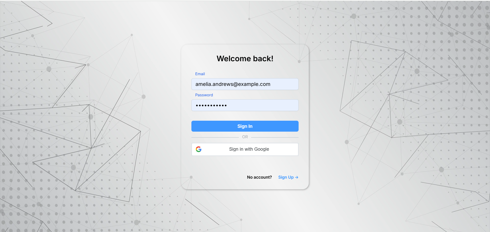
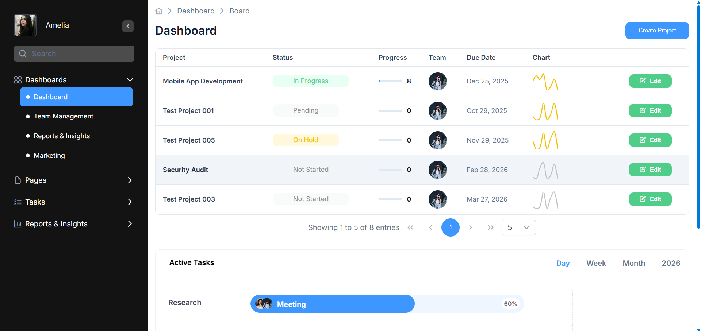
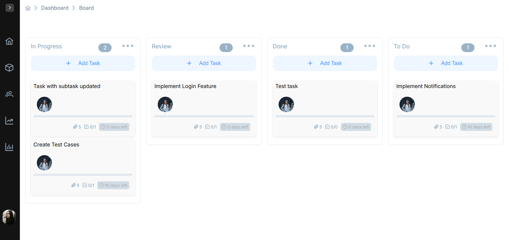
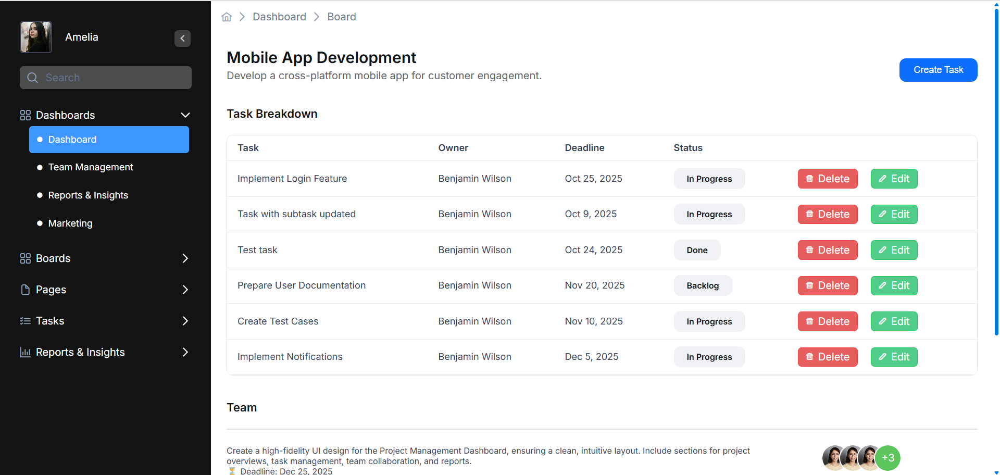
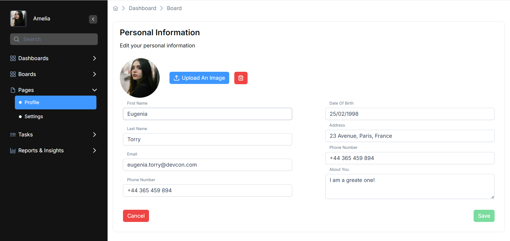

# 🧩 Project Management Platform

A a modern, cloud-ready Project Management System built with Angular and .NET 8 microservices architecture.
It allows teams to collaborate efficiently through boards, tasks, and real-time notifications, while maintaining a scalable and secure foundation.

---

## 📸 Screenshots
#### 🔐 Authentication
 

#### 🏠 Dashboard
 

#### 🗂️ Kanban  Board
 

#### 📋 Tasks
 

#### 👤 Profile
 

---

### Local Setup
```bash
# Clone the backend repo
git clone https://github.com/yourusername/project-management-platform.git
cd project-management-platform

# Run services
docker-compose up --build

# Run frontend
git https://github.com/el2toro/pm-platform-fe.git
cd pm-platform-fe
npm install
ng serve

```